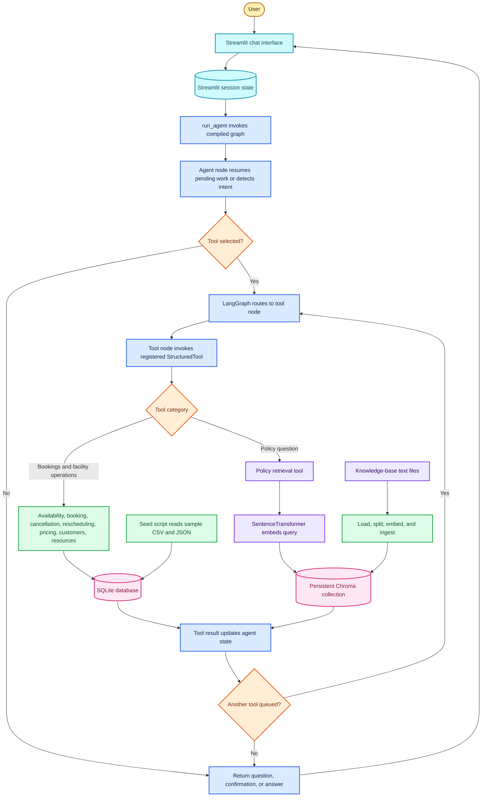
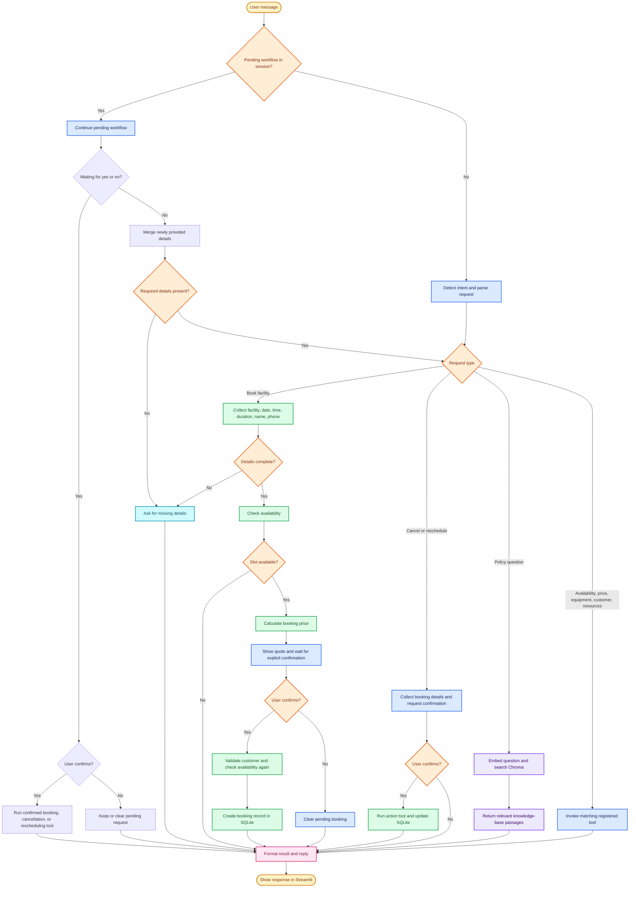

# SportMate AI

SportMate AI is a sports facility booking assistant with a Streamlit chat interface. A LangGraph workflow routes requests to Python tools for availability, pricing, booking management, and policy retrieval.

## Features

- Check availability for courts and other facilities.
- Create bookings through a multi-step flow with availability, price display, and explicit user confirmation.
- Cancel or reschedule existing bookings after confirmation.
- Look up facility pricing, equipment rental rates, and customer records.
- Answer questions using the SportMate policy knowledge base.
- Store resources, customers, and bookings in SQLite; use Chroma for policy retrieval.

## Architecture



### Request Lifecycle



### Components

- `app.py` renders the Streamlit chat, stores the transcript and pending conversation state, then invokes the graph once per user message.
- `src/agent/graph.py` compiles a LangGraph with an agent node and a tool execution node. Conditional routing runs tools when requested and ends the turn when the agent has a response or is waiting for confirmation.
- `src/agent/nodes.py` detects intents, extracts request details, preserves pending booking/cancellation/rescheduling/availability state, and formats tool results.
- `src/agent/tools.py` registers Python functions as LangChain `StructuredTool` instances. `src/tools/` contains the domain operations; `src/database/` provides SQLite access and seed loading.
- `src/rag/` loads policy documents, splits them into chunks, embeds them with `sentence-transformers/all-MiniLM-L6-v2`, and stores or retrieves vectors from Chroma.

Intent detection and detail extraction in the current request path are rule-based. A Groq client is initialized from configuration, and `GROQ_API_KEY` is currently required during startup; the graph does not make a chat-completion request for each message.

## Requirements

- Python 3.12 or later
- [uv](https://docs.astral.sh/uv/)
- A Groq API key

## Setup

1. Clone the repository and open its directory:

	```bash
	git clone https://github.com/sharan1370/SportMate-AI
	cd sportmate-ai
	```

2. Install the project dependencies:

	```bash
	uv sync
	```

3. Create a `.env` file in the project root and add your Groq API key. `GROQ_MODEL` defaults to `qwen/qwen3.6-27b`; current intent routing is rule-based, so changing this setting does not change the active request flow.

	```dotenv
	GROQ_API_KEY=your_groq_api_key
	# Optional
	GROQ_MODEL=qwen/qwen3.6-27b
	```

4. Create and seed the SQLite database with the sample resources, customers, and bookings:

	```bash
	uv run python -m src.database.seed
	```

5. Build the policy knowledge-base index in Chroma:

	```bash
	uv run python -m src.rag.ingest
	```

	The first ingestion downloads the `sentence-transformers/all-MiniLM-L6-v2` embedding model, so it can take a little longer and requires internet access.

## Run

Start the Streamlit app from the project root:

```bash
uv run streamlit run app.py
```

Streamlit prints a local URL in the terminal. Open it in a browser to use the assistant.

## Example Requests

- `Is BC1 available tomorrow at 7 PM for 1 hour?`
- `Book badminton court BC2 on 2026-09-20 at 7 PM for 1 hour`
- `How much is a badminton court for 1 hour?`
- `Cancel booking BKG1013`
- `Reschedule booking BKG1013`
- `How do cancellations and refunds work?`

Booking, cancellation, and rescheduling requests require confirmation before the corresponding change is made.

## Run Tests

Run the automated test suite with:

```bash
uv run pytest
```

## Project Structure

```text
app.py                 Streamlit user interface
src/agent/             LangGraph workflow, state, prompts, and tool registration
src/config/            Environment-based application settings
src/database/          SQLite connection, schema, repository, and seed data loader
src/rag/               Knowledge-base loading, embeddings, Chroma, and retrieval
src/tools/             Availability, booking, pricing, policy, and related tools
data/                  Sample resources, customers, and bookings
knowledge_base/        SportMate policy and facility information
tests/                 Automated tests
```

## Configuration and Data

`GROQ_API_KEY` is required to start the agent. Set `GROQ_MODEL` in `.env` to use a different Groq-supported model.

The seed command writes the local database to `db/booking.db`. The ingestion command writes the policy index to `vectorstore/chroma/`. Re-run these commands after changing the corresponding sample data or knowledge-base documents. Do not commit your `.env` file or expose API keys in source control.
